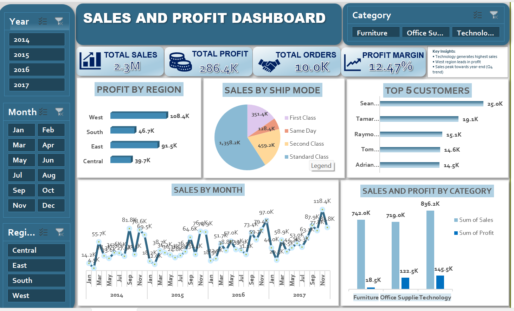

📊 Sales & Profit Dashboard (Excel)

📌 Overview

This project is an interactive sales dashboard built in Microsoft Excel to analyze sales performance, profit trends, and customer behavior.

🔧 Tools Used

Microsoft Excel

Pivot Tables

Pivot Charts

Slicers

📈 Key Features

Total Sales, Profit, Orders, and Profit Margin KPIs

Sales trend over time

Profit by region

Top 5 customers

Sales by category and shipping mode

Interactive slicers

💡 Key Insights

Technology category has highest sales

West region leads in profit

Sales increase towards year-end

### 📷 Dashboard Preview

